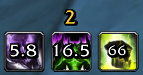

# PetTools

Requires nampower v3.0.0 or higher.

Inspired by https://github.com/Szalor/UnleashedTracker 

## Features
- Unleashed Potential icon with stacks, expiring timer and expiring/refresh sounds.
- Power Overwhelming icon with expiring timer.
- Pet Summon icon with expiring timer and expiring sound.

## Icon Controls

### Dragging
- Left-click and drag the **Unleashed Potential** icon to move the whole icon group.
- The **Power Overwhelming** and **Pet Summon** icons stay attached to the Unleashed Potential icon.

### Resizing (Shift + Mousewheel)
- Hold **Shift** and use the mousewheel while hovering either:
  - **Unleashed Potential** icon, or
  - **Power Overwhelming** icon.
- This resizes the full icon group (all three icons + text).

## Options
Use `/pettools` to open options.

Available options include:
- Reset icon position
- Unleashed Potential expiring sound toggle
- Pet expiring sound toggle
- Unleashed Potential Health Funnel refresh sound toggle
- Unleashed Potential crit refresh sound toggle
